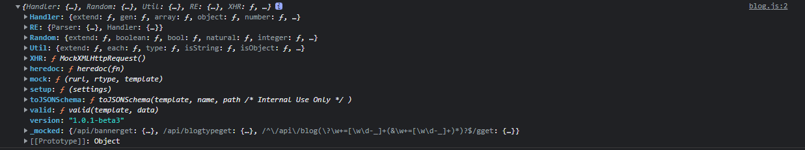

# `mockjs`

[TOC]


> mockjs的官方文档 ： https://github.com/nuysoft/Mock/wiki

## 安装mockjs

```powershell
npm install mockjs
```

## 导入 mockjs

```js
import Mock from 'mockjs';
```

`mockjs`依赖包的作用包括：

* 拦截Ajaxs请求
* 模拟生成虚拟数据

## mockjs简介

```js
console.log(typeof Mock); //object
```

```js
console.log(Mock);
```



导入的Mock从类型上来看是一个对象，里面提供了各种属性和方法，用来拦截请求或者生成各种虚拟数据。

在Mock对象中，最重要的是mock方法，该方法可以传入一个符合语法规范的数据对象，该数据对象经该方法编译后会返回一个的虚假模拟数据。

在`Mock.mock()`方法中传入的数据对象需要符合语法规范，而这里的语法规范分为两种，数据模板规范（DTD）和数据占位符规范（DPD）。

## mock方法

mockjs的拦截请求和编译返回模拟数据主要通过该方法完成。

包括了三个部分参数，请求url地址，请求方法类型，数据模板对象或者返回数据模板对象的函数。

```js
Mock.mock( rurl?, rtype?, template|function( options ) )
//rul 拦截的Ajaxs请求url地址
//rtype 拦截的Ajaxs请求类型
//tempalte 数据模板对象
//function(options) 返回数据模板对象的函数，可以传入参数options
//options 该参数接收了拦截的相关请求信息，封装成了对象，包括了:
//url(请求的url地址)，type(请求方法类型)，body(请求体)三个属性。
```

## 语法规范

### 数据模板规范

#### 模板规范

传入`Mock.mock`方法中的是一个数据模板对象或返回数据模板对象的函数，这里面的数据模板对象要符合数据模板规范。

**数据模板中的每个属性由 3 部分构成：属性名、生成规则、属性值：**

```js
// 属性名   name
// 生成规则 rule
// 属性值   value
'name|rule': value
```

* 属性名与生成规则共同组成对象的属性名，两者之间通过`|`隔开。
* 规则只会在数据模板中存在，经编译后生成的虚假数据中不会显示规则。
* 规则的格式以及规则后的数据类型共同决定了规则的含义。

#### 规则含义

1. ##### 规则`min-max`

* 属性值为字符串时。表示重复字符串随机次数生成一个新字符串，随机次数大于min,小于max。
* 属性值为数字时。表示生成一个大于等于 `min`、小于等于 `max` 的整数。
* 属性值为布尔值时。随机生成一个布尔值，值为 `value` 的概率是 `min / (min + max)`，值为 `!value` 的概率是 `max / (min + max)`。
* 属性值为对象时。从对象的属性值中随机选取 `min` 到 `max` 个属性。
* 属性值为数组时。通过重复数组的属性值生成一个新数组，重复次数大于等于 `min`，小于等于 `max`。

2. ##### 规则`count`

* 属性值为字符串时。表示重复字符串生成固定次数为count次的新字符串。
* 属性值为布尔值且count=1时。随机生成一个布尔值，值为 true 的概率是 1/2，值为 false 的概率同样是 1/2。
* 属性值为对象时。从对象中随机选取 `count` 个属性。
* 属性值为数组
  * 且count = 1时，从数组中随机选取 1 个元素，作为最终值。
  * 其他情况，通过数组属性值生成一个新数组，重复次数为 `count`。

3. ##### 规则`name|min-max.dmin-dmax`

* 属性值一般为数字。表示生成一个整数位数在[min,max]范围内,小数位数在[dmin-dmax]范围内的一个随机浮点数。

4. ##### 规则`name|min-max.dcount`

* 属性值一般为数字。表示生成一个整数位数在[min,max]范围内，小数位数为dcount位的随机浮点数。

5. ##### 规则`name|count.dmin-dmax`

* 属性值一般为数字。表示生成一个整数位数为count位，小数位数在[dmin-dmax]范围内的随机浮点数。

6. ##### 规则`name|count.dcount`

* 属性值一般为数字。表示生成一个整数位为count位，小数位数为dcount位的随机小数。

7. ##### 规则`name|+step`

* 属性值为数字，step = 1 时，通常表示从规则后面的属性值开始自增，每次增加的量为`step`。
* 属性值为数组时，step = 1 时，从数组中顺序选取一个元素，作为最终值。

### 数据占位符规范

*占位符* 只是在属性值字符串中占个位置，并不出现在最终的属性值中。

*占位符* 的格式为：

```js
@占位符
@占位符(参数 [, 参数])
```

## setup方法

目前常用于设置拦截Ajaxs请求后数据的响应时间。

```js
Mock.setup( settings )
// settings 为一个对象，对象中目前常见配置属性为timeout,设置拦截Ajaxs请求后数据的响应时间
```

## Random方法

Mock.Random 是一个工具类，用于生成各种随机数据。

**Mock.Random 的方法在数据模板中称为『占位符』，书写格式为 `@占位符(参数 [, 参数])` 。**

### 调用方法

```
var Random = Mock.Random
Random.email()
// => "n.clark@miller.io"
Mock.mock('@email')
// => "y.lee@lewis.org"
Mock.mock( { email: '@email' } )
// => { email: "v.lewis@hall.gov" }
```


### 常见占位符图表

Mock.Random 提供的完整方法（占位符）如下：

| Type          | Method                                                       |
| ------------- | ------------------------------------------------------------ |
| Basic         | boolean, natural, integer, float, character, string, range, date, time, datetime, now |
| Image         | image, dataImage                                             |
| Color         | color                                                        |
| Text          | paragraph, sentence, word, title, cparagraph, csentence, cword, ctitle |
| Name          | first, last, name, cfirst, clast, cname                      |
| Web           | url, domain, email, ip, tld                                  |
| Address       | area, region                                                 |
| Helper        | capitalize, upper, lower, pick, shuffle                      |
| Miscellaneous | guid, id                                                     |


