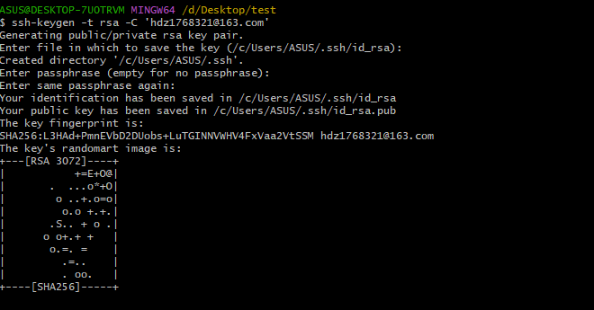
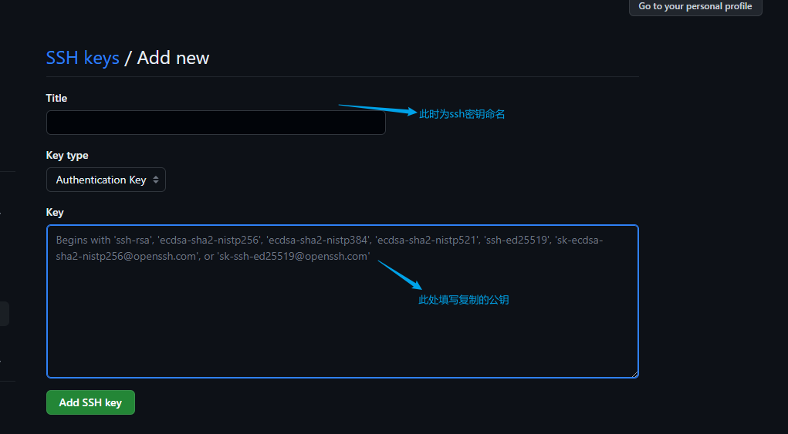

# nvm

> nvm的详细介绍的中文文档可见见：https://nvm.uihtm.com/

## nvm概述

nvm 全称为node.js version management,即node.js的版本管理工具。

由于node.js的各种版本存在不兼容的现象，而通过它能够帮助我们在多个node.js版本之间进行安装和切换。

## nvm的安装（window）

可以github的官网上下载nvm的最新版本

> nvm官网:https://github.com/coreybutler/nvm-windows/releases

## nvm的镜像源配置

在国内的环境，推荐使用镜像，加快下载速度。

也可以在nvm的安装路径下，找到 settings.txt，设置node_mirro与npm_mirror为国内镜像地址。

### 配置指令

- `nvm node_mirror [url]` ：设置node镜像。默认是https://nodejs.org/dist/。如果不写url，则使用默认url。设置后可至安装目录settings.txt文件查看，也可直接在该文件操作。
- `nvm npm_mirror [url]` ：设置npm镜像。https://github.com/npm/cli/archive/。如果不写url，则使用默认url。设置后可至安装目录settings.txt文件查看，也可直接在该文件操作。

### 国内镜像地址：

> 淘宝镜像：
>
> npm : https://npm.taobao.org/mirrors/npm/
>
> node : https://npm.taobao.org/mirrors/node/
>
> 阿里云镜像：
>
> npm : https://npmmirror.com/mirrors/npm/
>
> node : https://npmmirror.com/mirrors/node/

## nvm常用指令

### 显示node可下载版本的部分列表

```
$ nvm list available
```

> 需要查看完整的node版本请查看官网版本：
>
> https://nodejs.org/en/download/releases

### 安装指定node版本

```
$ nvm install 版本号
```

### 查看已安装版本

```
$ nvm list 或者 nvm ls
```

### 切换node版本

```
$ nvm use 版本号
```


## nvm指令汇总

- `nvm arch`：显示node是运行在32位还是64位。
- `nvm install <version> [arch]` ：安装node， version是特定版本也可以是最新稳定版本latest。可选参数arch指定安装32位还是64位版本，默认是系统位数。可以添加--insecure绕过远程服务器的SSL。
- `nvm list [available]` ：显示已安装的列表。可选参数available，显示可安装的所有版本。list可简化为ls。
- `nvm on` ：开启node.js版本管理。
- `nvm off` ：关闭node.js版本管理。
- `nvm proxy [url]` ：设置下载代理。不加可选参数url，显示当前代理。将url设置为none则移除代理。
- `nvm node_mirror [url]` ：设置node镜像。默认是https://nodejs.org/dist/。如果不写url，则使用默认url。设置后可至安装目录settings.txt文件查看，也可直接在该文件操作。
- `nvm npm_mirror [url]` ：设置npm镜像。https://github.com/npm/cli/archive/。如果不写url，则使用默认url。设置后可至安装目录settings.txt文件查看，也可直接在该文件操作。
- `nvm uninstall <version>` ：卸载指定版本node。
- `nvm use [version] [arch]` ：使用制定版本node。可指定32/64位。
- `nvm root [path]` ：设置存储不同版本node的目录。如果未设置，默认使用当前目录。
- `nvm version` ：显示nvm版本。version可简化为v。

# npm

> npm的介绍可以参考菜鸟教程中的文档:https://www.runoob.com/nodejs/nodejs-npm.html

## npm概述：

npm是随同NodeJS一起安装的包管理工具，能解决NodeJS代码部署上的很多问题

## 配置镜像源

使用淘宝镜像的命令：

```
$ npm install -g cnpm --registry=https://registry.npmmirror.com
```

## 创建模块

```
$ npm init //初始化工程，帮助生成package.json文件
$ npm init -y //初始化工程，全部使用默认配置生成package.json文件
```

输入初始化指令后，会进行以下操作。

```
This utility will walk you through creating a package.json file.
It only covers the most common items, and tries to guess sensible defaults.

See `npm help json` for definitive documentation on these fields
and exactly what they do.

Use `npm install <pkg> --save` afterwards to install a package and
save it as a dependency in the package.json file.

Press ^C at any time to quit.
name: (node_modules) runoob                   # 模块名 默认为根目录文件夹的名称 不能出现中文与空格
version: (1.0.0) 
description: Node.js 测试模块(www.runoob.com)  # 描述
entry point: (index.js) 
test command: make test
git repository: https://github.com/runoob/runoob.git  # Github 地址
keywords: 
author: 
license: (ISC) 
About to write to ……/node_modules/package.json:      # 生成地址

{
  "name": "runoob",
  "version": "1.0.0",
  "description": "Node.js 测试模块(www.runoob.com)",
  ……
}


Is this ok? (yes) yes
```


操作后，目录下会多一个packge.json的文件

```
{
  "name": "vue",
  "version": "1.0.0",
  "description": "",
  "main": "index.js",
  "scripts": {
    "test": "echo \"Error: no test specified\" && exit 1"
  },
  "keywords": [],
  "author": "",
  "license": "ISC"
}

```

### Package.json 属性说明

- **name** - 包名。
- **version** - 包的版本号。
- **description** - 包的描述。
- **homepage** - 包的官网 url 。
- **author** - 包的作者姓名。
- **contributors** - 包的其他贡献者姓名。
- **dependencies** - 依赖包列表。如果依赖包没有安装，npm 会自动将依赖包安装在 node_module 目录下。
- **repository** - 包代码存放的地方的类型，可以是 git 或 svn，git 可在 Github 上。
- **main** - main 字段指定了程序的主入口文件。这个字段的默认值是模块根目录下面的 index.js。
- **keywords** - 关键字

## 安装模块（包）

### 安装模块指令

```
$ npm install <Module Name>  #安装模块全写
$ npm i <Module Name>        #安装模块简写
$ npm i <Module Name>@版本号  #安装指定版本的模块（包）
```

### 全局安装

```
$ npm install <Module Name> -g #全局安装
```

1. 将安装包放在 /usr/local 下或者你 node 的安装目录。
2. 可以直接在命令行里使用。

### 本地安装

#### 安装普通依赖

```
$ npm install <Module Name>           # 本地安装
```

1. 将安装包放在 ./node_modules 下（运行 npm 命令时所在的目录），如果没有 node_modules 目录，会在当前执行 npm 命令的目录下生成 node_modules 目录。 
2. 可以通过 CommonJS或者Es Moudle来引入本地安装的包。

#### 安装开发依赖

```
$ npm install <Module Name> -D        #安装开发依赖
```

1. 开发依赖仅在开发环境中使用，打包后不会呈现在最终的代码里。

模块安装完成后，根目录下会出现package.lock.json，即版本锁定文件。

此外，会出现node.modules文件夹，里面存放的为本地安装的第三方模块（包）。

**不要对其进行重命名等修改**

## 查看安装模块（包）

你可以使用以下命令来查看所有全局安装的模块

```
$ npm list -g
```

如果要查看某个模块的版本号，可以使用命令如下：

```
$ npm list <Module Name>
```

查看包所有的版本

```
npm view <Module Name> versions
```


## 卸载模块（包）

我们可以使用以下命令来卸载 Node.js 模块。

```
$ npm uninstall <Module Name>   #卸载模块全写
$ npm un <Module Name>          #卸载模块简写
```

## 更新模块（包）

我们可以使用以下命令更新模块：

```
$ npm update <Module Name>
```

## 搜索模块（包）

使用以下来搜索模块：

```
$ npm search <Module Name>
```

# git

## git概述

git 项目开发时的版本控制工具

## git配置

### 查看配置

```
$ git config -l     #简写
$ git config --list #全写
$ git config --system --list #查看系统配置
$ git config --global --list #本地的用户配置
```

所有的配置文件在本地文件中均可见。

1. 系统配置的文件，存放在git安装目录下的gitconfig文件中。
2. 操作系统用户目录下的`.gitconfig`文件中。

> 如何在windows系统中，通过cmd命令执行git指令？
>
> 在windows的此电脑中查看属性，在设置中找到高级设置，设置环境变量，将git安装目录下的cmd文件夹目录复制，并添加到系统或用户的path路径编辑中，然后重启电脑即可。

### 配置用户名和邮箱

```
$ git config --global user.name '你的用户名'
$ git config --global user.email '你的邮箱'
```

##   git仓库

git仓库分为本地仓库和远程仓库（即github与gitee码云）。

### 本地仓库

git本地仓库的创建有两种方式，

1. 初始化仓库

   ```
   $ git init #初始化一个本地仓库
   ```

   

2. 从远程仓库克隆拉取仓库

   ```
   $ git clone url # 克隆一个远程仓库
   ```


初始化仓库或者是克隆一个本地仓库，均可使git获得当前文件目录的管理权（能够对目录的内容进行读写），此外，还会在当前目录下生成一个`.git`的隐藏文件（不要对其进行修改）。

编写的代码文件在进入本地仓库前，会有四种状态，经过三个区域。

### 文件的状态

* untracked 文件未跟踪（控制台会标红显示）
* tracked 文件已跟踪（控制台不会直接显示）
* unmodefied  文件未修改（控制台不会直接显示）
* modefied 文件文件已修改但未提交（控制台会标红显示）

### 三个区域

* wording space : 工作区   （用户直接编写的区域）
* stage/index : 暂存区 （需经过添加指令才能将工作区文件放入暂存区，暂存区的文件均处于已跟踪状态，但经过修改后需要重新跟踪并添加）
* history : 本地库 （本地仓库，需经过提交指令才能将暂存区文件放入本地库）

## git仓库区域

### 1. 查看本地库状态

```
$ git status #此命令可以查看目前文件的状态和所在区域
```

第一次初始化本地仓库后，执行该指令会出现以下效果


### 2. 文件从工作区添加到暂存区

#### （1）执行前状态

新建一个test.txt文件后，当前文件内容发生了变化，查看本地库状态


#### （2）指令

```
$ git add <fileName>  # 跟踪并添加单个文件到暂存区
$ git add .           # 跟踪并添加当前目录下所有未跟踪文件到暂存区
```

#### （3）执行后状态

执行指令后，查看本地库状态


### 3.文件从暂存区移除到工作区

#### （1）指令

```指令
$ git rm --cached <fileName>
```

#### （2）执行后状态


该指令执行后只会将文件从暂存区移除到工作区，并不会删除工作区的文件。

#### （3）特殊情况

但如果不执行文件移除指令，而直接在工作区删除文件。


此时文件虽然已经删除了，但并未从暂存区移除，所以之前文件添加到暂存区以及文件删除这两次变化状态会同时出现。这时，可以使用`git add <fileName> `或者`git rm <fileName>` 指令去更新本地库信息，告知工作区文件已删除，需要从暂存区移除该文件来更新状态。也可以使用`git restore <fileName>`指令在工作区恢复已删除文件。

### 4.文件从暂存区提交到本地库

#### （1） 指令

```
$ git commit -m  "日志信息" <fileName>    # -m 后添加的字符内容为提交日志 通过git relog 或者git log 可以查看到提交日志
```

#### （2）执行后的效果


在git中，内容变化是按行来计算的，如果不是linx系统，所以下会对换行符进行替换，。如果内容发生了变化，会先对原来的行进行删除，再对新的内容进行添加。

#### （3） 执行后的状态


### 5.文件的提交日志

#### （1）简略日志指令

```
$ git reflog
```

#### （2）执行后效果


#### （3）详细日志指令

```
$ git log
```

#### （4）执行后效果


### 6.文件修改与新版本提交

文件修改了内容，查看本地库状态。


文件的第二次提交


第二次提交后的日志变化


### 7.文件版本间的穿梭切换

#### （1）指令

```
$ git reset --hard <版本号>
```

#### （2）执行后效果


#### （3）执行后的日志情况


切换到对应版本后，工作区的内容也会回退到指定的版本那时的内容。

## git仓库分支

### 1.查看所有分支

#### （1）指令

```
$ git branch -v #默认分支为master
```

#### （2）执行后效果


显示当前分支 指向版本号 版本的提交日志

### 2.创建分支

#### （1）指令

```
$ git branch <分支名> #创建新的分支，但仍保持在当前分支
```

#### （2）查看所有分支


`*` 所指向的为当前所在分支。

### 3.切换分支

#### （1）指令

```
$ git checkout <分支名>
```

#### （2）执行效果


#### （3）查看分支


当前分支已切换到分支`newBranch`。

### 4.新分支中修改提交文件

新分支中修改和提交文件不会影响到其他分支的文件内容，只有该分支下的文件内容发生了变化。

### 5.合并分支

#### （1）指令

首先切换到要进行合并操作的分支 将其设为当前分支

```
$ git merge <将被合并的分支>
```

#### （2）执行效果


#### （3）正常合并

在要被合并的分支创建之后，如果进行合并操作的分支（当前分支）没有发生修改提交，或者虽然修改了，但与被合并的分支修改提交的不是同一个文件，那么当这两个分支进行合并时，会进行正常合并，被并入的分支会覆盖原来的分支。

#### （4）合并冲突与解决

在要被合并的分支创建之后，如果进行合并操作的分支（当前分支）发生了修改提交，且被合并的分支修改的是同一个文件，那么当这两个分支进行合并时，会产生合并冲突。这时git不知道哪一个分支中的哪些代码应该被保留，哪些又应该被删除，需要人为决定去留，然后提交后进行合并。

使用`git staus`,可以先找到那个文件发生了冲突。

使用`vim <冲突文件名>`，可以查看文件中的哪些地方发生了冲突。


## git 远程仓库

### 1.创建远程库

#### （1）创建远程库

首先在github或者gitee平台上注册登录账号，然后再创建远程仓库。复制创建远程库的http和ssh

#### （2）指令

```
$ git remote -v  #查看远程库
$ git remote add <别名> [url，即复制的http地址]  #给远程库命名，建议与本地库名称相同，便于开发
```

#### （3）查看创建后的远程库


### 2.创建ssh密钥（免密登录）

添加密钥后，克隆拉取私人仓库，提交远程库就不需要输入密码和账号等信息了。

#### （1）指令

```
$ ssh-keygen -t rsa -C 'hdz1768321@163.com'
```

#### （2）执行后效果



执行后会在用户目录下生成.ssh文件


文件中一个存放私钥，另一个存放公钥。

将公钥中的内容复制到github或者gitee的ssh keys中去。

这里以github为例。



### 3.推送本地库文件到远程库

#### （1）指令

```
$ git push 别名 分支   #推送远程库的最小单位是分支
```

#### （2）执行后效果


### 4.拉取远程库

#### （1）指令

```
$ git pull 别名 分支名
```

#### （2）执行后效果


**拉取与克隆的区别：克隆是克隆整个远程仓库，而拉取则是获取远程仓库更新的部分内容。******

### 5.克隆本地仓库

#### （1）指令

```
$ git clone http or ssh
```

#### （2）执行后效果


# webpack

## 安装webpack以及相关工具

建立在你已经安装好node.js的基础之上

### 1.安装

```
$ npm i webpack webpack-cli --save-dev   #安装webpack以及脚手架webpack-cli
```

### 2.查看安装版本

```
$ webpack -v
```

## 运行webpack

